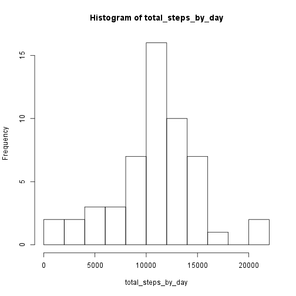
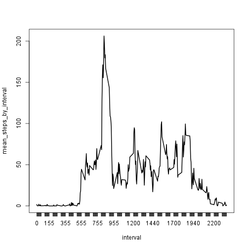
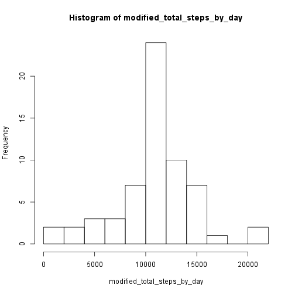
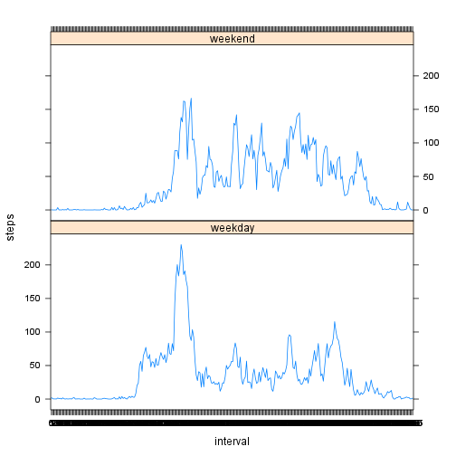

## Loading and preprocessing the data

```r
require(lattice)
require(plyr)

default.input_filename <- 'activity.csv'

obtain_input <- function(input_filename = default.input_filename) {
    setClass('dateCol')
    setAs("character", "dateCol", function(from) as.Date(from, format="%Y-%m-%d"))
    read.csv(input_filename, header=TRUE, sep=',', colClasses=c('integer', 'dateCol', 'integer'))
}

steps <- obtain_input()
summary(steps)
```

```
##      steps             date               interval     
##  Min.   :  0.00   Min.   :2012-10-01   Min.   :   0.0  
##  1st Qu.:  0.00   1st Qu.:2012-10-16   1st Qu.: 588.8  
##  Median :  0.00   Median :2012-10-31   Median :1177.5  
##  Mean   : 37.38   Mean   :2012-10-31   Mean   :1177.5  
##  3rd Qu.: 12.00   3rd Qu.:2012-11-15   3rd Qu.:1766.2  
##  Max.   :806.00   Max.   :2012-11-30   Max.   :2355.0  
##  NA's   :2304
```

## What is mean total number of steps taken per day?

```r
total_steps_by_day <- xtabs(steps ~ date, data=steps)
```
Frequency of daily step counts:

```r
hist(total_steps_by_day, breaks=9)
```

 

```r
mean_daily_steps <- mean(total_steps_by_day)
median_daily_steps <- median(total_steps_by_day)
```
Mean daily steps: 10766.19

Median daily steps: 10765.00

## What is the average daily activity pattern?

```r
mean_steps_by_interval <- xtabs(steps ~ interval, aggregate(steps ~ interval,steps,mean))
plot(mean_steps_by_interval, type="l")
```

 

```r
max_interval <- sort(mean_steps_by_interval)[length(mean_steps_by_interval)]
```

Interval 835 has maximum average steps: 206.17

## Imputing missing values
A total of 2304 intervals are missing step data. Let's replace these missing intervals with the mean interval value across all days:

```r
impute.mean <- function(x) replace(x, is.na(x), mean(x, na.rm=TRUE))
modified_steps <- ddply(steps, ~ interval, transform, steps = impute.mean(steps))
```
What does the total steps taken each day look like after replacing missing interval data with the interval's mean?

```r
modified_total_steps_by_day <- xtabs(steps ~ date, data=modified_steps)
hist(modified_total_steps_by_day, breaks=9)
```

 

```r
modified_mean_daily_steps <- mean(modified_total_steps_by_day)
modified_median_daily_steps <- median(modified_total_steps_by_day)
```
Mean modified daily steps: 10766.19

Median modified daily steps: 10766.19

Both the frequency of step-buckets and the mean and median of modified total daily steps do not appear to have significantly changed compared to the unmodifed total daily steps with missing values removed.

## Are there differences in activity patterns between weekdays and weekends?

```r
modified_steps$daytype <- 'weekday'
modified_steps$daytype[weekdays(modified_steps$date) %in% c('Saturday', 'Sunday')] <- 'weekend'
modified_steps$daytype <- as.factor(modified_steps$daytype)

modified_by_interval_and_date <- as.data.frame(xtabs(steps ~ interval + daytype, aggregate(steps ~ interval + daytype, modified_steps, mean)))
names(modified_by_interval_and_date)[3] <- 'steps'

xyplot(steps ~ interval | daytype, data=modified_by_interval_and_date, type="l", layout=c(1,2))
```

 

